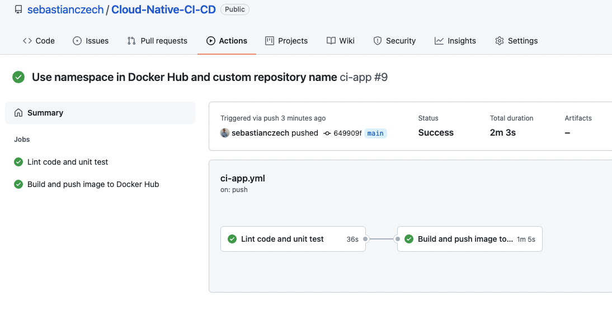
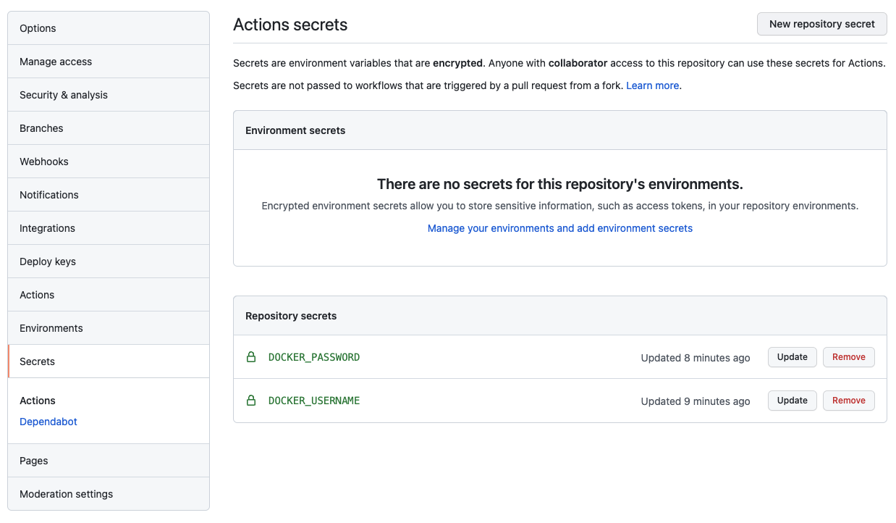
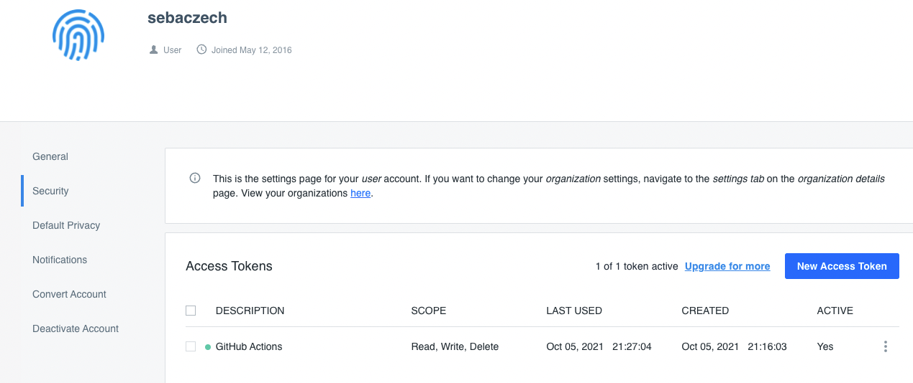

# Cloud-Native-CI-CD

Example of continuous integration and deploy pipelines, configuration and code for simple cloud native application.

## Prerequisites

### Install ``diagrams`` tools

```bash
python3 -m venv venv
source venv/bin/activate

pip install diagrams

brew install graphviz
```

### Install ``boto3``

```bash
pip install boto3
```

### Install ``localstack``

```bash
pip install localstack
pip install localstack-client
```

### Install ``pytest``

```bash
pip install pytest
```

### Freeze installed packages

```bash
pip freeze > requirements.txt
```

## Design

### Generate pictures from code

```bash
cd design
python cloud_native_ci.py
python cloud_native_cd.py
```

### Continuous integration pipeline


### Continuous deployment pipeline


## Infrastructure

### Pipeline - continuous integration

#### GitHub actions



#### GitHub secrets



#### Docker Hub tokens



### Pipeline - continuous deployment

Install [Tekton](https://tekton.dev/docs/getting-started/):

```bash
kubectl apply --filename https://storage.googleapis.com/tekton-releases/pipeline/latest/release.yaml
kubectl get pods --namespace tekton-pipelines
```

Install Tekton CLI:

```bash
brew tap tektoncd/tools
brew install tektoncd/tools/tektoncd-cli
```

Create simple *a* task in file [`tkn-task-pull-image.yml`](infra/pipelines/tkn-task-pull-image.yml) and apply task:

```bash
kubectl apply -f tkn-task-pull-image.yml -n tekton-pipelines
```

Show task:

```bash
tkn task list -n tekton-pipelines

tkn task start pull-docker-image --dry-run -n tekton-pipelines
```

Start task:

```bash
tkn task start pull-docker-image -n tekton-pipelines

tkn taskrun logs pull-docker-image-run-mpkms -f -n tekton-pipelines

tkn taskrun logs --last -f -n tekton-pipelines
```

Create dashboard:

```bash
kubectl apply --filename https://github.com/tektoncd/dashboard/releases/latest/download/tekton-dashboard-release.yaml
kubectl proxy --port=8080
```

Access dashboard [localhost:8080/api/v1/namespaces/tekton-pipelines/services/tekton-dashboard:http/proxy/](http://localhost:8080/api/v1/namespaces/tekton-pipelines/services/tekton-dashboard:http/proxy/) or use port forwarding to access dashboard on [localhost:9097](localhost:9097):

```bash
kubectl --namespace tekton-pipelines port-forward svc/tekton-dashboard 9097:9097
```

### Localstack

Start AWS services on local machine:

```bash
cd infra/localstack
docker-compose up
```

Test localstack:

```bash
pytest test_localstack.py
```

### Terraform

Provision DynamoDB and S3:

```bash
cd infra/terraform
terraform init
terraform plan
terraform apply --auto-approve
```

Check DynamoDB:

```bash
aws --endpoint-url=http://localhost:4566 dynamodb list-tables

aws --endpoint-url http://localhost:4566 dynamodb scan --table-name demo-dynamodb-tf
```

Create S3 bucket and check it:

```bash
aws --endpoint-url=http://localhost:4566 s3 mb s3://demo-bucket-cli
aws --endpoint-url=http://localhost:4566 s3api put-bucket-acl --bucket demo-bucket-cli --acl public-read

aws --endpoint-url=http://localhost:4566 s3 ls
aws --endpoint-url=http://localhost:4566 s3 ls s3://demo-bucket-cli
```

## Application

### Running

```bash
cd app/src
python main.py
LOCALSTACK_HOST=192.168.0.106 python main.py # connect to different Localstack host
```

### Containerization

```bash
docker build --tag python-localstack-client -f app/Dockerfile .
docker run --name python-localstack-client --rm python-localstack-client
docker run --name python-localstack-client --rm -it -e LOCALSTACK_HOST=192.168.0.106 python-localstack-client # change Localstack host
docker run --name python-localstack-client --rm -it python-localstack-client bash # run bash instead of command
```

### Testing

```bash
cd app
pytest tests
pytest -s tests # print to console
INFRA_LOCALSTACK_PROTOCOL=http INFRA_LOCALSTACK_ADDRESS=127.0.0.1 INFRA_LOCALSTACK_PORT=4566 pytest tests
```