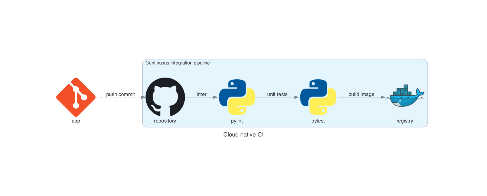
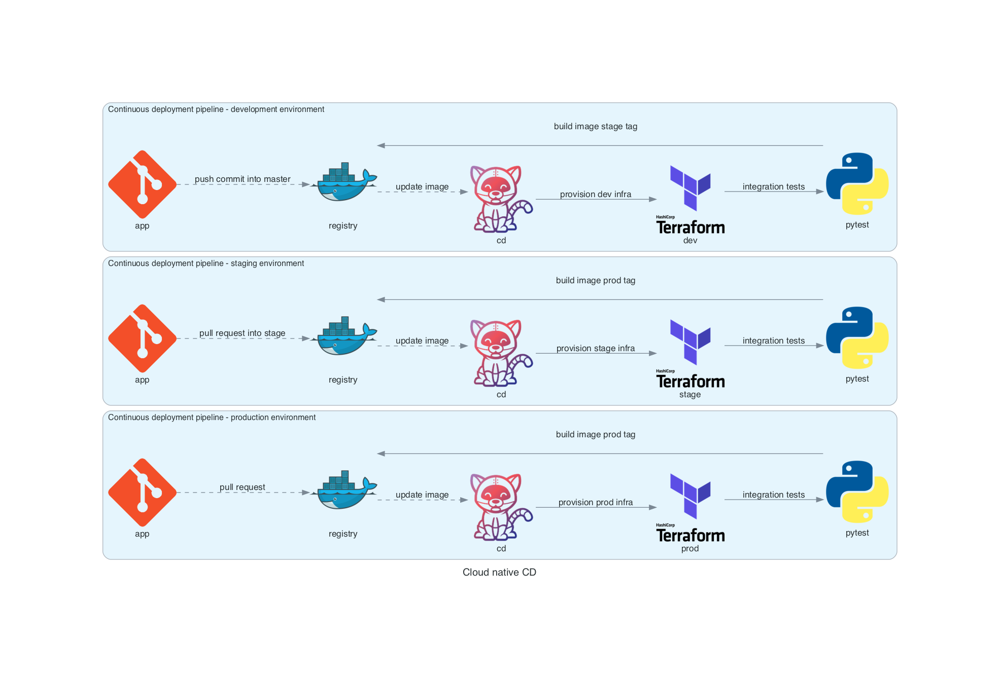

# Cloud-Native-CI-CD

Example of continuous integration and deploy pipelines, configuration and code for simple cloud native application.

## Prerequisites 

### Install ``diagrams`` tools

```bash
python3 -m venv venv
source venv/bin/activate

pip install diagrams

brew install graphviz
```

### Install ``boto3``

```bash
pip install boto3
```

### Install ``localstack``

```bash
pip install localstack
pip install localstack-client
```

### Freeze installed packages

```bash
pip freeze > requirements.txt
```

## Design

### Generate pictures from code

```bash
cd design
python cloud_native_ci.py
python cloud_native_cd.py
```

### Continuous integration pipeline



### Continuous deployment pipeline



## Infrastructure

### Localstack

Start AWS services on local machine:

```bash
cd infra/localstack
docker-compose up
```

### Terraform

Provision DynamoDB and S3:

```bash
cd infra/localstack
terraform init
terraform plan
terraform apply --auto-approve
```

Check DynamoDB:

```bash
aws --endpoint-url=http://localhost:4566 dynamodb list-tables

aws --endpoint-url http://localhost:4566 dynamodb scan --table-name demo-dynamodb-tf
```

Create S3 bucket and check it:

```bash
aws --endpoint-url=http://localhost:4566 s3 mb s3://demo-bucket-cli
aws --endpoint-url=http://localhost:4566 s3api put-bucket-acl --bucket demo-bucket-cli --acl public-read

aws --endpoint-url=http://localhost:4566 s3 ls
aws --endpoint-url=http://localhost:4566 s3 ls s3://demo-bucket-cli
```

## Application

```bash
cd app
python main.py
```