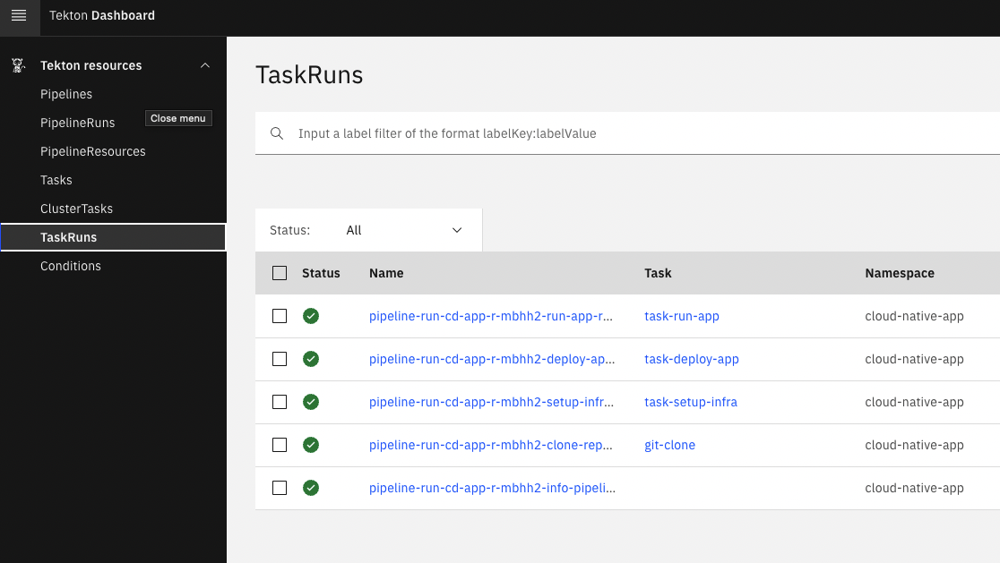

# Cloud-Native-CI-CD

Example of continuous integration and deploy pipelines, configuration and code for simple cloud native application.

## Prerequisites

All Python packages can installed from ``requirements.txt``:

```
pip install -r requirements.txt
```

### Install ``diagrams`` tools

All diagrams were generated from code using ``diagrams`` tool:

```bash
python3 -m venv venv
source venv/bin/activate

pip install diagrams

brew install graphviz
```

### Install ``boto3``

[``boto3`` library is used to connect to AWS services](https://github.com/boto/boto3):

```bash
pip install boto3
```

### Install ``localstack``

[``localstack`` tool can be used to start Localstack. Alternative solution is to use Docker Compose to start Localstack](https://github.com/localstack/localstack):

```bash
pip install localstack
pip install localstack-client
```

### Install ``pytest``

Tests in Python were prepared in ``pytest``:

```bash
pip install pytest
```

### Freeze installed packages

Save all installed libraries to file:

```bash
pip freeze > requirements.txt
```

### TektonCD

Install [Tekton](https://tekton.dev/docs/getting-started/):

```bash
kubectl apply --filename https://storage.googleapis.com/tekton-releases/pipeline/latest/release.yaml
kubectl get pods --namespace tekton-pipelines
```

Install Tekton CLI to manage TektonCD:

```bash
brew tap tektoncd/tools
brew install tektoncd/tools/tektoncd-cli
```

## Design

Before starting work on preparing application, pipelines, Kubernetes objects for application, infrastructure code and tests, there were prepared diagrams using approach everything as a code.

### Generate pictures from code

```bash
cd design
python cloud_native_ci.py
python cloud_native_cd.py
```

### Continuous integration pipeline


### Continuous deployment pipeline


## Infrastructure

### Pipeline - continuous integration

Continuous integration pipeline is configured in GitHub. GitHub action is defined in [workflow ci-app](.github/workflows/ci-app.yml). Pipeline is using secrets to access Docker Hub. Configuration of an action and secrets is presented below on screenshots.

#### GitHub actions


#### GitHub secrets


#### Docker Hub tokens


### Pipeline - continuous deployment

Continuous deployment pipeline is configured in TektonCD. Before executing pipeline, there is a need to prepare namespace:

```
kubectl create namespace cloud-native-app
kubens cloud-native-app
```

Pipeline is using external tasks, so there is a need to install referenced tasks for [cloning git repositories](https://hub.tekton.dev/tekton/task/git-clone):

```
kubectl apply -f https://raw.githubusercontent.com/tektoncd/catalog/main/task/git-clone/0.4/git-clone.yaml -n cloud-native-app
```

Similar approach was to used to install referenced tasks for [Kubernetes actions](https://hub.tekton.dev/tekton/task/kubernetes-actions):

```
kubectl apply -f https://raw.githubusercontent.com/tektoncd/catalog/main/task/kubernetes-actions/0.2/kubernetes-actions.yaml -n cloud-native-app
```

To apply all prepared TektonCD objects, following commands should be used:

Create tasks:

```bash
kubectl apply -f infra/pipelines -n cloud-native-app
```

Define RBAC:

```bash
kubectl apply -f infra/app/rbac.yml
```

Service accounts, cluster roles and bindings can be checked by commands:

```bash
kubectl get serviceaccounts -n cloud-native-app
kubectl get clusterrole
kubectl get clusterrolebinding
```

To check some of the objects, following commands can be used e.g. to show task:

```bash
tkn task list -n cloud-native-app

tkn task start pull-docker-image --dry-run -n cloud-native-app
```

In case of a need to manually start task, following command should be used:

```bash
tkn task start pull-docker-image -n cloud-native-app
```

To verify task runs, we can check logs by command:

```bash
tkn taskrun logs pull-docker-image-run-mpkms -f -n cloud-native-app
tkn taskrun logs --last -f -n cloud-native-app
```

Beside CLI, TektonCD has dashboard, which can be accessed by:

```bash
kubectl apply --filename https://github.com/tektoncd/dashboard/releases/latest/download/tekton-dashboard-release.yaml
kubectl proxy --port=8080
```

Then you can access dashboard [localhost:8080/api/v1/namespaces/tekton-pipelines/services/tekton-dashboard:http/proxy/#/about](http://localhost:8080/api/v1/namespaces/tekton-pipelines/services/tekton-dashboard:http/proxy/#/about) or use port forwarding to access dashboard on [localhost:9097](http://localhost:9097):

```bash
kubectl --namespace tekton-pipelines port-forward svc/tekton-dashboard 9097:9097
```

You can get metrics e.g. for Prometheus by accessing ``http://localhost:9090/metrics`` after configuring forwarding:

```bash
kubectl --namespace tekton-pipelines port-forward svc/tekton-pipelines-controller 9090:9090
```

Using [Tekton Pipelines Tutorial](https://github.com/tektoncd/pipeline/blob/main/docs/tutorial.md) and [Build and deploy a Docker image on Kubernetes using Tekton Pipelines](https://developer.ibm.com/tutorials/build-and-deploy-a-docker-image-on-kubernetes-using-tekton-pipelines/) it was prepared whole CD pipeline.

After every change of pipeline, definition needs to be update:

```bash
kubectl apply -f infra/pipelines -n cloud-native-app
```

Pipeline can be started:

```bash
tkn pipeline start pipeline-cd-app -n cloud-native-app --use-param-defaults --workspace name=shared-data,claimName=pvc-pipelines,subPath=dir
```

Tekton pipelines, pipeline runs, tasks and task runs from dashboard are presented in following screenshots:




To remove all completed or failed pipeline runs, you can use commands:

```bash
kubectl delete pod --field-selector=status.phase==Failed
kubectl delete pod --field-selector=status.phase==Succeeded
```

After finish of work to clean tasks and runs following commands can be used:

```bash
tkn pipelinerun delete --all -f
tkn pipeline delete --all -f
tkn taskrun delete --all -f
tkn task delete --all -f
```

At the end namespace should be removed:

```bash
kubectl delete namespace cloud-native-app
```

And docker images and other not used object can be removed:

```bash
docker system prune
```

### Localstack

Start AWS services on local machine:

```bash
cd infra/localstack
docker-compose up
```

or using Python app:

```
localstack start
```

Test localstack:

```bash
pytest test_localstack.py
```

### Terraform

Provision DynamoDB and S3:

```bash
cd infra/terraform
terraform init
terraform plan
terraform apply --auto-approve
```

Check DynamoDB:

```bash
aws --endpoint-url=http://localhost:4566 dynamodb list-tables

aws --endpoint-url http://localhost:4566 dynamodb scan --table-name demo-dynamodb-tf
```

Create S3 bucket and check it:

```bash
aws --endpoint-url=http://localhost:4566 s3 mb s3://demo-bucket-cli
aws --endpoint-url=http://localhost:4566 s3api put-bucket-acl --bucket demo-bucket-cli --acl public-read

aws --endpoint-url=http://localhost:4566 s3 ls
aws --endpoint-url=http://localhost:4566 s3 ls s3://demo-bucket-cli
```

Download files from S3 bucket:

```bash
aws --endpoint-url=http://localhost:4566 s3 ls s3://demo-bucket-py
aws --endpoint-url=http://localhost:4566 s3 cp s3://demo-bucket-py/simple_file_with_binary_data.txt .
```

Publish message to SNS:

```
aws --endpoint-url=http://localhost:4566 sns list-topics
aws --endpoint-url=http://localhost:4566 sns create-topic --name demo-sns-cli
aws --endpoint-url=http://localhost:4566 sns publish --topic-arn arn:aws:sns:us-east-1:000000000000:demo-sns-cli --message "Test message sent to SNS on Localstack"
```

Prepare SQS queue to receive notifications:

```
aws --endpoint-url=http://localhost:4566 sqs list-queues
aws --endpoint-url=http://localhost:4566 sqs create-queue --queue-name demo-sqs-cli 

```

Receive message from SNS:

```
aws --endpoint-url=http://localhost:4566 sns subscribe \
              --topic-arn arn:aws:sns:us-east-1:000000000000:demo-sns-cli \
              --protocol sqs \
              --notification-endpoint http://localhost:4566/000000000000/demo-sqs-cli

aws --endpoint-url=http://localhost:4566 sqs receive-message --queue-url http://localhost:4566/000000000000/demo-sqs-cli
```

## Application

### Running

```bash
cd app/src
python main_localstack_client.py
LOCALSTACK_HOST=172.17.0.2 python main_localstack_client.py # connect to different Localstack host
```

### Containerization

```bash
docker build --tag python-localstack-client -f app/Dockerfile .
docker run --name python-localstack-client --rm python-localstack-client
docker run --name python-localstack-client --rm -it -e LOCALSTACK_HOST=172.17.0.2 python-localstack-client # change Localstack host
docker run --name python-localstack-client --rm -it python-localstack-client bash # run bash instead of command
```

### Testing

```bash
cd app
pytest tests
pytest -s tests # print to console
INFRA_LOCALSTACK_PROTOCOL=http INFRA_LOCALSTACK_ADDRESS=127.0.0.1 INFRA_LOCALSTACK_PORT=4566 pytest tests
EDGE_PORT=9999 pytest test_main_localstack_client.py
```