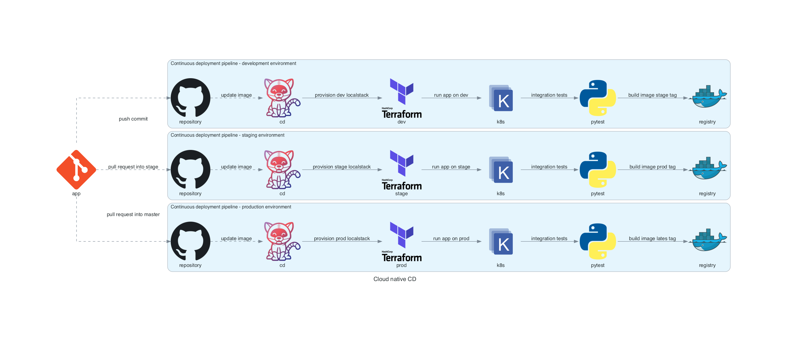

# Cloud-Native-CI-CD

Example of continuous integration and deploy pipelines, configuration and code for simple cloud native application.

## Prerequisites 

```bash
python3 -m venv venv
source venv/bin/activate

pip install diagrams

brew install graphviz
```

## Design

```bash
cd design
python cloud_native_ci.py
python cloud_native_cd.py
```




